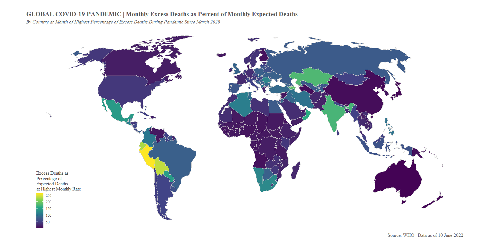

# WHO_Excess_Deaths
This project includes R code that explores and visualizes the WHO's excess death dataset as related to the COVID-19 pandemic. The impetus for this work was an inquiry early on in the pandemic about how we could better understand COVID deaths and impacts knowing that many countries had poor surveillance data.

