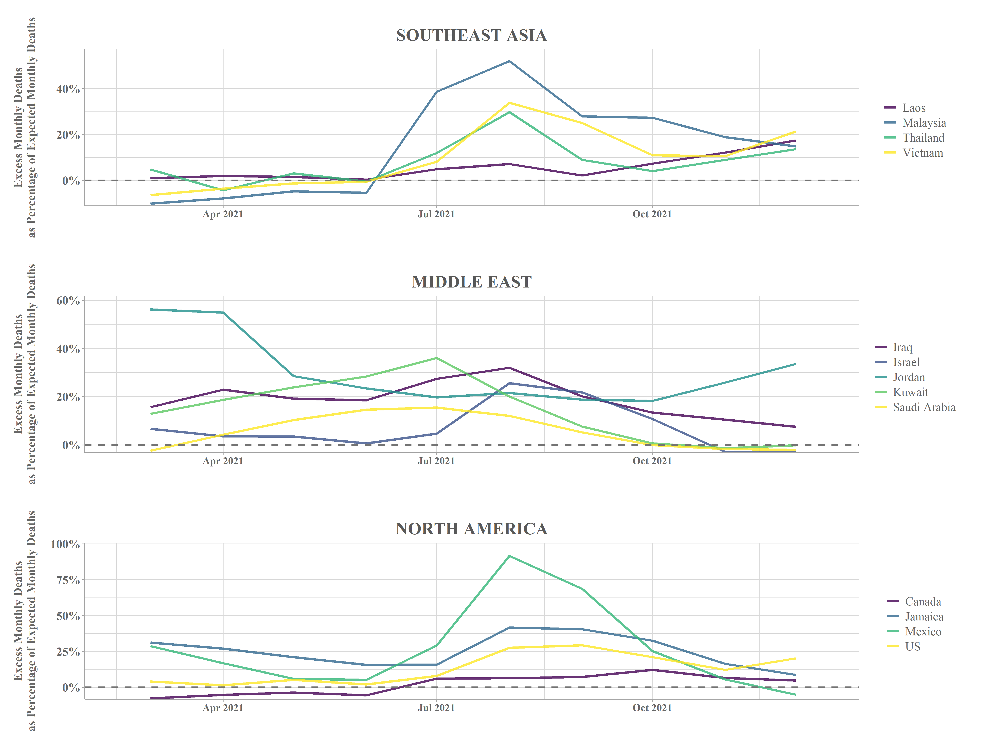

# Visualizing and Analyzing Excess Death Data from WHO to Gauge COVID-19 Impacts

Early in the COVID-19 pandemic, it became clear that poor COVID-19 surveillance and reporting in many countries was hampering efforts to understand the full impact of the virus. Stakeholders needed a better indication of where healthcare capacity was falling short in preventing COVID deaths. As jounalistic outlets began releasing excess death datasets, it became clear that these numbers could be used to estimate the impact of COVID beyond officially reported death numbers. 

This project includes R code that explores and visualizes the WHO's excess death dataset as related to the COVID-19 pandemic. In particular, it was designed to produce the following deliverables:

1. An R script that calculates and visualizes (with a bar graph and map) mean excess monthly deaths as a percentage of mean expected monthly deaths and filters the maximum percentage for all countries over the duration of the pandemic. 
2. An R function that allows stakeholders to create time-series graphs of batches of countries with a start and end date of interest.
 
Below are some examples of deliverables from this project, including a graph and map of the countries reporting the highest monthly percentage of excess deaths relative to expected deaths over the entire pandemic duration (up to March 2022) as well as two trios of time-series visualizations from the R excess deaths percentage time series function I wrote. 

The global map indicates with clarity that the highest impact of excess deaths was felt in South America, with Peru, Bolivia, and Ecuador among the countries most affected.

An accompanying bar graph with annotations indicating the month of the highest excess death percentage offers a temporal perspective. While the surges in excess deaths in South America occurred relatively early during the pandemic (Spring through Summer 2020), other countries with high excess percentages (e.g. India, Oman, and Mexico) did not see their largest surges until the Summer of 2021. 

